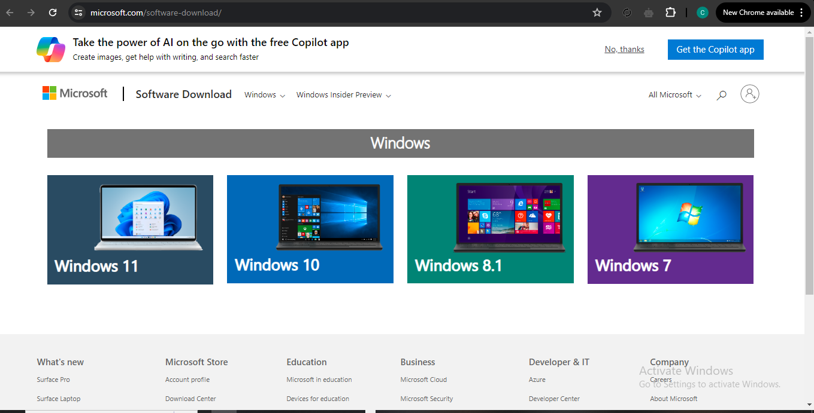

# Dev_Setup
Setup Development Environment

#Assignment: Setting Up Your Developer Environment

#Objective:
This assignment aims to familiarize you with the tools and configurations necessary to set up an efficient developer environment for software engineering projects. Completing this assignment will give you the skills required to set up a robust and productive workspace conducive to coding, debugging, version control, and collaboration.

#Tasks:

1. Select Your Operating System (OS):
   Choose an operating system that best suits your preferences and project requirements. Download and Install Windows 11. https://www.microsoft.com/software-download/windows11 

   isit the Microsoft Software Download Page:

Go to the official Microsoft website for downloading Windows:
Microsoft Software Download 

You will see a page similar to this:

Select Windows Version:

Choose the version of Windows you want to download. This could be Windows 10 or Windows 11, depending on your preference and system requirements.

Click on the "Download tool now" button or "Download Windows XX" (where XX is the version number).

Download the Media Creation Tool:

After clicking the download button, you will be prompted to download the Media Creation Tool. This tool allows you to create installation media or upgrade your current PC to Windows.

Run the Media Creation Tool:

Once the Media Creation Tool is downloaded, run it by double-clicking the downloaded file (usually named MediaCreationTool.exe).

You may see a user account control prompt asking for permission. Click "Yes" to continue.

Accept License Terms:

Read and accept the license terms to proceed with downloading Windows. Click on "Accept" to continue.

Choose Installation Option:

Select whether you want to upgrade your current PC or create installation media (USB flash drive, DVD, or ISO file) for another PC. For a new installation, choose "Create installation media (USB flash drive, DVD, or ISO file) for another PC" and click "Next".

Select Language, Edition, and Architecture:

Choose the language, edition, and architecture (32-bit or 64-bit) that matches your requirements. Ensure you select the correct options before proceeding.

Choose Media Type:

Select the media type you want to create (USB flash drive, DVD, or ISO file). If you choose USB flash drive, make sure it’s connected to your computer. Click "Next".

Download and Create Installation Media:

The tool will now download the necessary files and create the installation media according to your selections.

Finish and Verify:

Once the process completes, you’ll see a confirmation message. Follow any additional prompts to finish the process.

Installation Media Ready:

Your Windows installation media (USB flash drive, DVD, or ISO file) is now ready. You can use it to install Windows on your computer.

Notes:
Make sure to backup any important data before proceeding with Windows installation.
Ensure your computer meets the minimum system requirements for the selected version of Windows.

2. Install a Text Editor or Integrated Development Environment (IDE):
   Select and install a text editor or IDE suitable for your programming languages and workflow. Download and Install Visual Studio Code. https://code.visualstudio.com/Download

   -Open your web browser and go to the Visual Studio Code download page. 
   -Choose the appropriate installer for your operating system (Windows, macOS, or Linux). For Windows, click on the "Windows" button.
   -Once the download is complete, locate the downloaded file (usually in your Downloads folder) and double-click on it to run the installer.
   -Read the license agreement, check the box to accept the terms, and click "Next".
   -Select the destination folder where you want to install VS Code. The default location is usually fine. Click "Next".
   -Choose any additional tasks you want to be performed while installing VS Code, such as creating a desktop icon. Click "Next".
   -click "Install" to begin the installation process.
   -Once the installation is complete, check the box to launch VS Code and click "Finish".
   -On the first launch, you might see a welcome screen with options to customize your setup, view documentation, or install recommended extensions.
   -To install extensions:
   -Click on the Extensions icon in the Activity Bar on the side of the window or press Ctrl+Shift+X to open the Extensions view.
   -Type the name of the extension you want to install in the search bar, and click the "Install" button next to the extension name.
   _To configure vscode:
   -Click on the gear icon in the lower-left corner and select "Settings" to open the Settings view.
   -Browse through the settings and customize them according to your preferences.
   

3. Set Up Version Control System:
   Install Git and configure it on your local machine. Create a GitHub account for hosting your repositories. Initialize a Git repository for your project and make your first commit. https://github.com

   -Go to the official Git website: https://git-scm.com/ 
   -Click on the download link for your operating system (Windows, macOS, or Linux). 
   -Run the installer you downloaded.
   -Follow the installation steps. It's generally fine to use the default settings. Click "Next" through the options.
   -Make sure to select the option to "Use Git from the command line and also from 3rd-party software" when prompted.
   -Click "Install" to complete the installation
   -On Windows, open the Command Prompt or Git Bash.
   -Type the following command, replacing "Your Name" with your actual name: git config --global user.name "Your Name"
   -Type the following command, replacing "your.email@example.com" with your actual email address: git config --global user.email "your.email@example.com"
   -To check your configuration, type: git config --list  . This command will display the configuration settings you have just set up.
   
   Create a GitHub Account
   -Go to https://github.com/
   -Click "Sign up" and follow the instructions to create a new account.
   -In your terminal or command prompt, navigate to the location where you want to create your project directory.
   -Create a new directory and navigate into it: 
   mkdir my-project
   cd my-project
   -Inside your project directory, initialize a new Git repository:
   git init
   -Create a simple README file to add to your repository:
   echo "# My Project" > README.md
   -Commit the file to your repository with a message:
   git commit -m "Initial commit"
   -Go to GitHub and create a new repository.
   -Give it a name, description, and choose whether it will be public or private.
   -Do not initialize with a README, .gitignore, or license (since you've already done this locally).
   -Follow the instructions provided by GitHub to push an existing repository from the command line:
   git remote add origin https://github.com/your-username/your-repo-name.git
   git branch -M main
   git push -u origin main

4. Install Necessary Programming Languages and Runtimes:
  Instal Python from http://wwww.python.org programming language required for your project and install their respective compilers, interpreters, or runtimes. Ensure you have the necessary tools to build and execute your code.

  -Open your web browser and go to https://www.python.org/. 
  -Click on the "Downloads" tab in the navigation bar.
  =You will see the latest version of Python available for download.   
   -Click on the "Download Python X.X.X" button (where X.X.X is the version number).
   -Depending on your operating system, the website will automatically suggest the appropriate installer (Windows, macOS, or Linux). If not, select the correct installer for your operating system from the list provided.
   -Once downloaded, run the installer executable file (e.g., python-X.X.X.exe).
   -During the installation process, make sure to check the box that says "Add Python X.X to PATH" to allow Python to be accessible from the command line. 
   -Follow the prompts to complete the installation. It's recommended to use the default settings unless you have specific preferences.
   -Open your command prompt or terminal depending on your operating system.
   -Type the following command to check if Python is installed and to see the version: python --version
   -This command will output the installed Python version, confirming that Python is installed correctly.
   -Depending on your project requirements, you may need additional tools such as package managers (pip for Python), IDEs (like PyCharm or Visual Studio Code), or virtual environments (like venv).
   -Install pip (Python Package Manager): pip is usually installed automatically with Python. You can upgrade it using: python -m pip install --upgrade pip
   -Download and install an IDE suitable for Python development, such as PyCharm or Visual Studio Code.
   -Use venv to create isolated Python environments for different projects: python -m venv myenv
   source myenv/bin/activate  # on macOS/Linux
   myenv\Scripts\activate  # on Windows

5. Install Package Managers:
   If applicable, install package managers like pip (Python).
   
   -Before installing pip, make sure Python is installed on your system. Python 3.4 and later versions typically come with pip pre-installed.
   -Open a command prompt or terminal.
   -Type the following command to check if pip is already installed: pip --version
   -If pip is installed, you will see its version number. If not, you'll get an error indicating that the command is not found.
   -Windows users who have installed Python using the official installer should have pip installed by default. However, you may need to add Python and pip to your system PATH if it's not done automatically.
   -Ensure Python is added to PATH during installation. You can check this by running Python from the command prompt (python should launch Python).
   -To install pip explicitly (although it should be included):
   -Download get-pip.py script from https://bootstrap.pypa.io/get-pip.py
   -Open a command prompt and navigate to the directory where get-pip.py is downloaded
   -Run the following command: python get-pip.py
   -After installation, verify pip by checking its version again: pip --version
   -Once pip is installed, you can use it to install Python packages from the Python Package Index (PyPI) or other repositories:
   -To install a package: pip install package_name
   -To install a specific version of a package: pip install package_name==version_number
   -To upgrade a package: pip install --upgrade package_name
   -To uninstall a package: pip uninstall package_name

6. Configure a Database (MySQL):
   Download and install MySQL database. https://dev.mysql.com/downloads/windows/installer/5.7.html

   Visit MySQL Downloads Page:
Go to the MySQL Community Downloads page at https://dev.mysql.com/downloads/windows/installer/5.7.html.

Select MySQL Installer:

Scroll down to find the MySQL Installer for Windows.
Click on the "Download" button next to the MySQL Installer for Windows.
Install MySQL Server using MySQL Installer
Run the Installer:

Once the installer file is downloaded, double-click it to run.
If prompted by User Account Control (UAC), click "Yes" to allow the installer to make changes to your device.
Choose Setup Type:

The MySQL Installer will launch. Click "OK" to proceed.
On the Setup Type page, choose "Custom" to customize the installation, or select "Server only" for a basic installation that includes only the MySQL Server and its dependencies.
Click "Next" to continue.
Select Products:

On the Products page, select the MySQL Server version you wish to install. For example, MySQL Server 5.7 or later versions.
Optionally, select other MySQL products or features you may need, such as MySQL Workbench (a graphical tool for managing and querying MySQL databases).
Click "Next" to proceed.
Installation Process:

The installer will download and install the selected MySQL products and dependencies.
Follow the prompts to configure MySQL Server settings, such as port number, root password, and other advanced options as needed.
Click "Next" to continue.
Complete the Installation:

Once the installation completes successfully, you will see the "Installation Complete" screen.
Optionally, check the "Start MySQL Server at System Startup" box if you want MySQL Server to start automatically when Windows starts.
Click "Finish" to exit the installer.
Verify MySQL Installation:

Open a command prompt or terminal.
Type mysql -V and press Enter to verify the MySQL version installed. You should see the MySQL server version number if the installation was successful.
MySQL Workbench (Optional)
If you installed MySQL Workbench or any other tools along with MySQL Server:

Launch MySQL Workbench:

Search for "MySQL Workbench" in your Windows Start menu and open it.
Connect to MySQL Server:

In MySQL Workbench, click on the "+" icon next to "MySQL Connections" to set up a new connection.
Enter the connection details, including hostname (usually localhost), port (default is 3306), username (root), and the password you set during installation.
Click "Test Connection" to ensure MySQL Workbench can connect to the MySQL Server.

7. Set Up Development Environments and Virtualization (Optional):
   Consider using virtualization tools like Docker or virtual machines to isolate project dependencies and ensure consistent environments across different machines.

   Install Docker Desktop:

Visit the Docker website at https://www.docker.com/products/docker-desktop.
Download the Docker Desktop installer for your operating system (Windows or macOS).
Run the installer and follow the on-screen instructions to complete the installation.
Verify Docker Installation:

After installation, Docker Desktop should be running on your system.
Open a terminal or command prompt and type docker --version to verify that Docker is installed correctly.
Run Docker Containers:

Docker uses containers to package applications and their dependencies. You can find official images for popular software on Docker Hub (https://hub.docker.com/) or create your own Dockerfile.
Pull an image from Docker Hub using docker pull image_name.
Run a container using docker run image_name.
Set Up Docker Compose (Optional):

Docker Compose is a tool for defining and running multi-container Docker applications. It allows you to use a YAML file to configure your application’s services and their dependencies.
Install Docker Compose by following the instructions for your operating system from the Docker documentation (https://docs.docker.com/compose/install/).
Build and Manage Containers:

Use docker build to build an image from a Dockerfile.
Use docker-compose up to start containers defined in your docker-compose.yml file.
Use docker-compose down to stop and remove containers.
Using Virtual Machines (e.g., VirtualBox, VMware)
Install a Virtualization Platform:

Download and install a virtualization platform such as VirtualBox (https://www.virtualbox.org/) or VMware (https://www.vmware.com/).
Create a Virtual Machine (VM):

Launch the virtualization software and click on "New" to create a new virtual machine.
Follow the wizard to configure the VM settings, including memory, CPU, storage, and network options.
Install Guest Operating System:

Insert the installation media (ISO file) for the guest operating system (e.g., Ubuntu, CentOS) into the VM.
Start the VM and follow the installation prompts to install the operating system.
Set Up Development Environment:

Once the guest operating system is installed, install necessary development tools, programming languages, and dependencies within the VM.
Configure network settings to allow communication between the host machine and the VM if needed.
Snapshot and Clone VMs (Optional):

Virtualization platforms often provide features like snapshotting and cloning VMs. Use these features to create backups or replicate development environments quickly.

8. Explore Extensions and Plugins:
   Explore available extensions, plugins, and add-ons for your chosen text editor or IDE to enhance functionality, such as syntax highlighting, linting, code formatting, and version control integration.
   
   
   
   

9. Document Your Setup:
    Create a comprehensive document outlining the steps you've taken to set up your developer environment. Include any configurations, customizations, or troubleshooting steps encountered during the process. 

#Deliverables:
- Document detailing the setup process with step-by-step instructions and screenshots where necessary.
- A GitHub repository containing a sample project initialized with Git and any necessary configuration files (e.g., .gitignore).
- A reflection on the challenges faced during setup and strategies employed to overcome them.

#Submission:
Submit your document and GitHub repository link through the designated platform or email to the instructor by the specified deadline.

#Evaluation Criteria:**
- Completeness and accuracy of setup documentation.
- Effectiveness of version control implementation.
- Appropriateness of tools selected for the project requirements.
- Clarity of reflection on challenges and solutions encountered.
- Adherence to submission guidelines and deadlines.

Note: Feel free to reach out for clarification or assistance with any aspect of the assignment.
